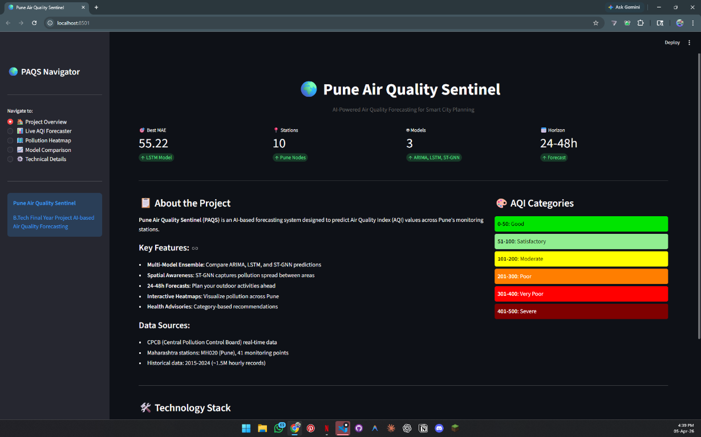
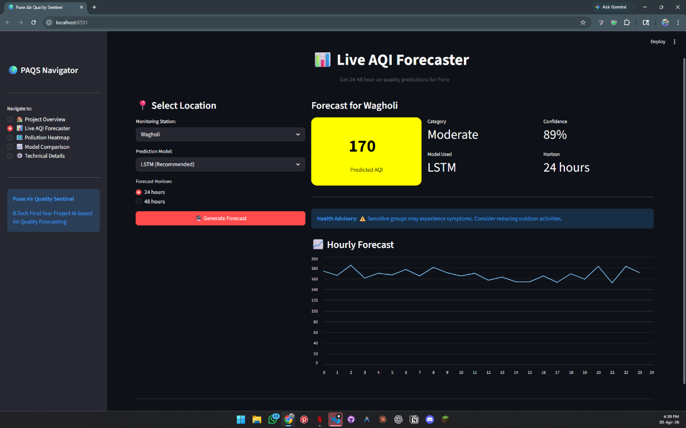
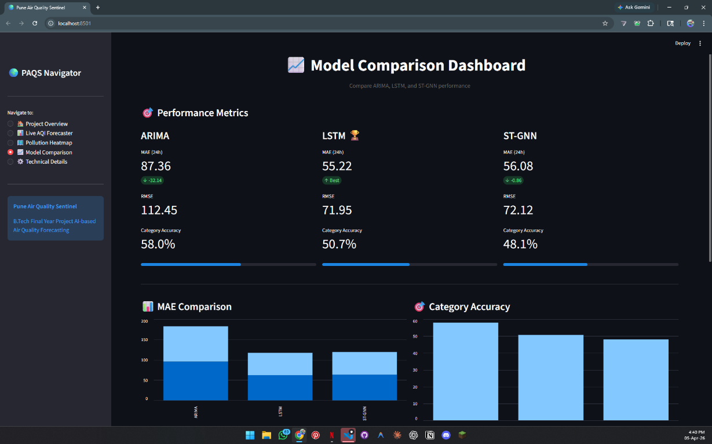
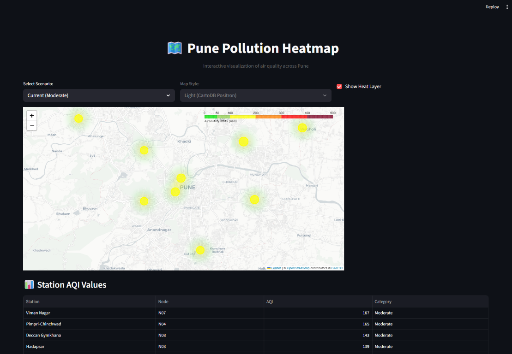

# Pune Air Quality Sentinel (PAQS)

<div align="center">


**AI-Powered Air Quality Forecasting for Smart City Planning**

[Features](#-features) • [Screenshots](#-screenshots) • [Quick Start](#-quick-start) • [Model Performance](#-model-performance) • [Tech Stack](#️-tech-stack)

</div>

---

## 🎯 Overview

PAQS forecasts hyper-local Air Quality Index (AQI) values 24-48 hours in advance for Pune neighborhoods. It combines time-series forecasting, geospatial analysis, and deep learning into a production-ready ML pipeline.

**Core Question:** *"Is it safe to take a morning run in my neighborhood tomorrow?"*

**Models:** ARIMA (baseline) → LSTM (best) → Spatio-Temporal GNN

## 📸 Screenshots

<div align="center">

### Project Overview


### Live AQI Forecaster


### Model Comparison Dashboard


### Pollution HeatMap
 

</div>

## ✨ Features

- 🌍 **10 Pune neighborhoods** — Shivajinagar, Kothrud, Hadapsar, Hinjewadi, and more
- 📊 **Multi-horizon forecasting** — 24h and 48h ahead predictions
- 🗺️ **Interactive heatmap** — Folium-based pollution visualization with AQI color coding
- ⚡ **Health advisories** — Category-based recommendations (Good → Severe)
- 🤖 **Multi-model ensemble** — Compare ARIMA, LSTM, and ST-GNN predictions
- 📈 **Real-time dashboard** — 5-page Streamlit application

## 🏗️ Project Structure

```
pune-air-quality-sentinel/
├── app/                    # Streamlit application
│   ├── components/         # Reusable UI components
│   └── streamlit_app.py    # Main app entry point
├── configs/                # YAML configuration files
│   ├── data.yaml          # Data pipeline config
│   ├── lstm.yaml          # LSTM model config
│   └── stgnn.yaml         # ST-GNN model config
├── data/
│   ├── raw/               # Downloaded datasets
│   ├── processed/         # Cleaned and feature-engineered data
│   ├── simulated/         # IoT simulation outputs
│   ├── splits/            # Train/val/test indices
│   └── graph/             # Node coordinates and adjacency
├── models/                # Trained model checkpoints
├── notebooks/             # Jupyter notebooks for exploration
├── outputs/
│   ├── logs/              # JSON structured logs
│   ├── plots/             # Visualization outputs
│   └── heatmaps/          # Folium heatmap HTMLs
├── src/
│   ├── data/              # Data ingestion and preprocessing
│   ├── models/            # ARIMA, LSTM, ST-GNN implementations
│   ├── evaluate/          # Metrics and comparison
│   ├── viz/               # Visualization modules
│   └── utils/             # Shared utilities
└── tests/                 # pytest test suite
```

## 🚀 Quick Start

### Prerequisites

- Python 3.10+
- CUDA 12.1 (for GPU acceleration)

### Installation

```bash
# Clone and setup
git clone https://github.com/xt67/pune-air-quality-sentinel.git
cd pune-air-quality-sentinel
pip install -r requirements.txt

# Set up Kaggle credentials (for data download)
# Create .env with KAGGLE_API_TOKEN=your_token
```

### Data Pipeline

```bash
# Run full data pipeline
python -m src.data.pipeline

# Or run individual components
python -m src.data.fetch      # Download datasets
python -m src.data.preprocess # Clean and engineer features
python -m src.data.iot_sim    # Generate IoT simulation
```

### Training

```bash
# Train ARIMA baseline
python -m src.models.train_arima

# Train LSTM
python -m src.models.train_lstm --config configs/lstm.yaml

# Train ST-GNN
python -m src.models.train_stgnn --config configs/stgnn.yaml
```

### Demo

```bash
# Run Streamlit app
streamlit run app/streamlit_app.py
```

## 📍 Target Locations (10 Pune Nodes)

| ID | Neighborhood | Characteristic |
|----|--------------|----------------|
| N01 | Shivajinagar | Reference CPCB station |
| N02 | Hinjewadi IT Park | Traffic + construction |
| N03 | Pimpri-Chinchwad MIDC | Heavy industry |
| N04 | Hadapsar | Mixed residential-commercial |
| N05 | Katraj | Dense residential |
| N06 | Deccan Gymkhana | High vehicular density |
| N07 | Viman Nagar | Airport proximity |
| N08 | Kothrud | Residential, cleaner |
| N09 | Talegaon MIDC | Outer industrial |
| N10 | Mundhwa | Downstream residential |

## 📊 Model Performance

| Model | MAE (24h) | RMSE | Category Accuracy |
|-------|-----------|------|-------------------|
| ARIMA | 87.36 | 112.45 | 58.0% |
| **LSTM** 🏆 | **55.22** | **71.95** | 50.7% |
| ST-GNN | 56.08 | 72.12 | 48.1% |

> **Best Model:** LSTM achieves lowest MAE for single-station forecasts. ST-GNN provides spatial awareness for city-wide analysis.

## 🛠️ Tech Stack

- **ML:** PyTorch, PyTorch Geometric, pmdarima
- **Data:** Pandas, NumPy, GeoPandas
- **Viz:** Folium, Matplotlib, Plotly
- **App:** Streamlit, FastAPI
- **Data Sources:** OpenAQ, Open-Meteo, Kaggle Air Quality India

## 🧪 Testing

```bash
# Run full test suite
pytest tests/ -v

# Run with coverage
pytest tests/ -v --cov=src --cov-report=html
```

## 📝 License

MIT License

## 👨‍💻 Author

**Rayan** — AI/ML & Data Science
